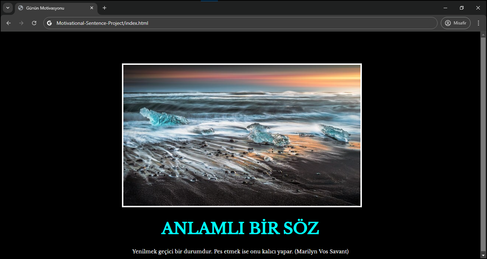
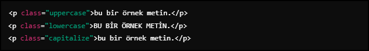

## _Html ve css özelliklerini kullanarak bir site oluşturdum. Öğrendiklerimi paylaşmak istedim._  

[ ***BURADAN ULAŞABİLİRSİNİZ*** ](https://fidanmuhammed.github.io/full-stack-web-development-projects/Motivational-Sentence-Project/)

 

&nbsp

&nbsp

Bu site bir tane resimden ve motive eden bir sözden oluşuyor. Resmi ortalamak için div kullandım. Ortalama işlemi epey uğraştırdı çünkü başta resmin genişliğini değiştirmemiştim. Eğer genişliği öylece bırakır manuel olarak değiştirmezseniz yani `width:auto` olduğu zaman bu tasarımlarınızda tutarlılığınızı engelleyebiliyor. Bu yüzden o kısmı `width:100%` olarak değiştirdim.

&nbsp
 

**Neler öğrendim?**
- *Css'te text-transform kullanımı*
- *Boyut ayarlarken rem kullanımı*
- *width:auto özelliğinin önemi*
  
  
 text-transform: Metinlerin büyük harf, küçük harf veya her kelimenin ilk harfini büyük yaparak okunabilirliği ve estetiği artırır. Uzun yazılarda işinize yarayabilir. 
 
 

  ***
  rem: CSS'te kök font boyutuna göre değişim sağlar. Kullanıcıların tarayıcı ayarlarına göre font boyutunu değiştirmesi durumunda, tüm öğelerin orantılı olarak ölçeklenmesini mümkün kılar. `em` ise bulunduğu elementin font boyutuna bağlı olarak değiştiği için hatalar meydana getirebilir. 
  
  
  
  ***
  width kullanımı: `width: 100%` kullandığımız zaman resim veya öğe bulunduğu kapsayıcının genişliğine uyum sağlar. Eğer manuel olarak ayarlamazsak `width:auto` seçeneği varsayılan olduğu için aktif olur. Bu da
  sayfa düzenini bozabilir ve resmin boyutlanmasında sıkıntı yaşatabilir.
